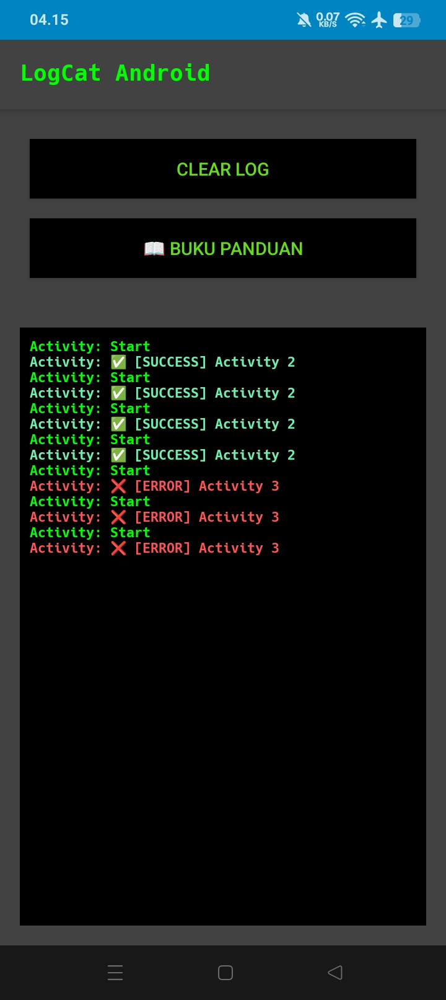
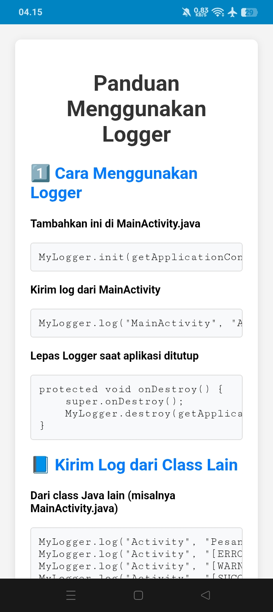

# ⚡ LogCat Android 📱

**LogCat Android** adalah aplikasi logcat **tanpa root** dan **tanpa PC** dengan UI simpel yang bahkan bisa digunakan sambil merem 👀. Dirancang untuk developer, opreker, dan siapapun yang ingin memantau log aplikasi lain langsung di HP.

---

## 🚀 Fitur Utama
✅ **Tanpa root & tanpa PC** – bisa langsung jalan di HP non-root  
✅ **UI super simpel** – bahkan sambil merem tetap bisa dipakai  
✅ **High performance** – mampu menangkap log hingga **100x/detik**  
✅ **Panduan terintegrasi** – sudah ada buku panduan di dalam aplikasi  
✅ **Auto scroll & copy log** – memudahkan saat debugging aplikasi lain  

---

## ⚠️ **Catatan Penting**
📱 **Aplikasi ini hanya bisa digunakan jika:**
1. LogCat Android **dan** aplikasi yang ingin di-debug **berjalan di 1 device yang sama**.  
   > 🚫 Tidak bisa jika 1 HP untuk LogCat & 1 HP lain untuk aplikasi debug.  

2. **Buka LogCat Android dulu** sebelum membuka aplikasi yang ingin di-debug.  
   > 🚫 Jika urutan dibalik, LogCat tidak akan menerima log.  

---

## 📥 Download APK
👉 [**Download LogCat Android v1.0**](https://github.com/Proot9/LogCat_Android_NonRoot/releases/tag/v1.1)  

---

## 📸 Screenshot
| UI Utama                | Panduan di Aplikasi       |
|-------------------------|----------------------------|
|  |  |

---

## Closing
Terima kasih untuk dukungan kalian, kami harap aplikasi ini bisa membantu kalian semua yang emang lagi membutuhkan😘

Jika kalian ingin update fitur, atau ada masalah dengan aplikasi langsung aja kontak saya di email📩

Dadah Good Luck guys!🔥

---
## Kontak Kami
elzyproot@protonmail.com
---
## ☕ Dukungan
- ❤️ [Saweria](https://saweria.co/elzy01engineer) 
---

## 📜 Lisensi
Proyek ini open-source dengan lisensi [MIT License](LICENSE).

---
