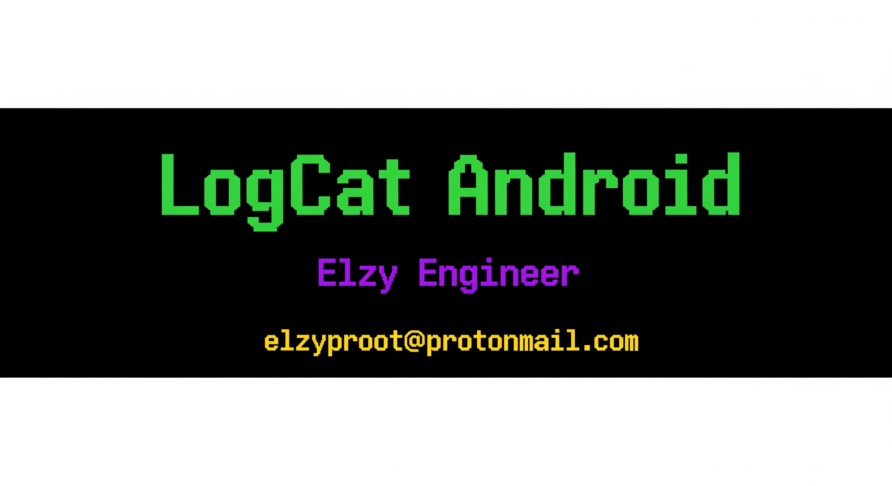

# ⚡ LogCat Android 📱

**LogCat Android** is a logcat application that works **without root** and **without a PC**, featuring a simple UI that’s so easy to use you could almost operate it with your eyes closed 👀. Designed for developers, tinkerers, and anyone who needs to monitor app logs directly on their Android device.

---

## Language
[English 🇬🇧](README_EN.md) | [Русский 🇷🇺](README_RU.md)

---

## 🚀 Key Features
✅ **No root & no PC required** – works seamlessly on non-rooted devices  
✅ **Ultra-simple UI** – so easy even beginners can use it  
✅ **High performance** – capable of displaying logs up to **100x per second**  
✅ **Built-in user guide** – includes integrated instructions within the app  
✅ **Auto-scroll & copy log** – makes debugging smoother and faster  

---

## ⚠️ Important Notes
📱 **This app works only if:**
1. **LogCat Android** and the target app you want to debug **are running on the same device**.  
   > 🚫 It will not work if you run LogCat on one phone and the target app on another.  

2. **Open LogCat Android first** before opening the app you want to debug.  
   > 🚫 If you open them in the wrong order, LogCat will not capture any logs.  

---

## 📥 Download APK
👉 [**Download LogCat Android**](https://github.com/Proot9/LogCat_Android_NonRoot/releases/)  

---

## 📸 Screenshots
| Main UI                 | In-App Guide              |
|-------------------------|----------------------------|
|  |  |

---

## 🙏 Thank You!
Thanks for your support! We hope this app helps anyone in need of a **simple yet powerful logcat tool** 😘  

If you want new features or encounter any issues, feel free to contact me via email 📩  

---

## 📬 Contact
📧 **elzyproot@protonmail.com**

---

## ☕ Support Me
If you appreciate this app, you can buy me a coffee:  
❤️ [Saweria](https://saweria.co/elzy01engineer)  

---

## 📜 License
This project is open-source and licensed under the [MIT License](LICENSE).